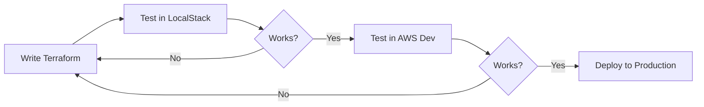

# 🗄️ LED AWS Terraform Infrastructure

Modular Terraform setup for RDS PostgreSQL and ElastiCache Redis with support for LocalStack and AWS.

## Why use LocalStack?

LocalStack is a Local cloud emulator, which provides a AWS "clone" to be used when validating infrastructure, API communication, learning and avoid cloud bills with tests. It can be used with AWS CLI to verify resource "creation" so it can be confidently deployed in the actual cloud.

Testing infrastructure on real AWS:
- **Costs money** - Even "testing" creates billable resources
- **Slow** - RDS takes 5-10 minutes to provision
- **Risky** - Easy to forget resources running ($$$)
- **Cleanup hassle** - Have to destroy everything after testing

It can be used on CI/CD pipelines to validate Terraform configuration and guarantee an error free structure.

| Aspect | LocalStack | Real AWS |
|--------|-----------|----------|
| **Cost** | Free | $$ Pay per resource |
| **Speed** | Seconds | Minutes |
| **Risk** | Zero | High (forgot destroy?) |
| **Learning** | Safe sandbox | Expensive mistakes |
| **Terraform Testing** | ✅ Perfect | 💸 Overkill |

### ❌ What LocalStack Cannot Do

1. **Real database connections** - Cannot run SQL queries against LocalStack RDS
2. **Performance testing** - Not representative of real AWS
3. **Complete feature parity** - Some advanced AWS features missing

### Recommended Pipeline



## 📁 Project Structure

```
root/
├── modules/
│   ├── rds-postgres/           # 🐘 PostgreSQL module
│   └── elasticache-redis/      # 🔴 Redis module
└── environments/
    ├── localstack/             # 🏠 Local development
    │   ├── network.tf
    │   ├── main.tf
    │   ├── provider.tf
    │   ├── backend.hcl
    │   ├── outputs.tf
    │   └── setup.sh
    └── prod/                   # ☁️ Production AWS
        ├── network.tf
        ├── main.tf
        ├── provider.tf
        ├── backend.hcl
        └── outputs.tf
```

## 🚀 Quick Start

### LocalStack (Free Local Testing)

```bash
# 1. Start LocalStack
docker run -d -p 4566:4566 localstack/localstack

# 2. Setup environment
cd environments/localstack
./setup.sh

# 3. Deploy
terraform init -backend-config=backend.hcl
terraform apply

# 4. Get connection info
terraform output
```

### Production (AWS)

```bash
# 1. Setup AWS credentials
aws configure

# 2. Create state bucket
aws s3 mb s3://YOUR-BUCKET-NAME

# 3. Update backend.hcl with your bucket name
cd environments/prod
vim backend.hcl  # Replace YOUR-BUCKET-NAME

# 4. Deploy
terraform init -backend-config=backend.hcl
terraform apply
```

> [!WARNING]
> Production creates real AWS resources that cost money. Always `terraform destroy` when done testing.

## 🏗️ What Gets Created

### Network Resources (per environment)
- VPC (10.0.0.0/16)
- 2 Private subnets in different AZs
- Security groups for RDS and Redis

### Database Resources
- **RDS PostgreSQL 14**
  - KMS key for password encryption
  - Managed password via Secrets Manager
  - db.t3.micro (localstack) / db.t3.small (prod)

- **ElastiCache Redis 7.0**
  - Single-node cluster
  - cache.t3.micro (localstack) / cache.t3.small (prod)

## 🔄 Switching Environments

```bash
# Work on LocalStack
cd environments/localstack
terraform plan

# Work on Production
cd environments/prod
terraform plan
```

> [!TIP]
> Each environment has isolated state - changes in one don't affect the other.

## 📦 Module Design

Modules create subnet groups internally but accept existing subnets from parent:

```hcl
module "rds" {
  source = "../../modules/rds-postgres"
  
  name               = "my-db"
  security_group_ids = [aws_security_group.rds.id]
  database_name      = "mydb"
  
  # Module creates subnet group using these subnets
  # Pass subnets via aws_subnet resources
}
```

> [!NOTE]
> Subnet groups are created inside modules but reference subnets passed from the environment.

## 🔌 Connecting to Services

```bash
# Get endpoints
terraform output

# PostgreSQL
psql -h <rds_address> -p 5432 -U admin -d leddb

# Redis
redis-cli -h <redis_endpoint> -p 6379
```

> [!TIP]
> RDS passwords are auto-generated and stored in AWS Secrets Manager. Retrieve with:
> ```bash
> aws secretsmanager get-secret-value --secret-id <secret-arn>
> ```

## 🛠️ Common Commands

```bash
terraform init -backend-config=backend.hcl  # Initialize
terraform plan                              # Preview changes
terraform apply                             # Apply changes
terraform output                            # Show outputs
terraform destroy                           # Destroy everything
```

## 🎯 Using Existing VPC

Already have a VPC? Just modify `network.tf`:

```hcl
data "aws_vpc" "existing" {
  id = "vpc-xxxxxxxx"
}

data "aws_subnets" "existing" {
  filter {
    name   = "vpc-id"
    values = [data.aws_vpc.existing.id]
  }
}

# Use data sources instead of creating resources
```

## 🧹 Cleanup

```bash
# LocalStack
cd environments/localstack
terraform destroy

# Production
cd environments/prod
terraform destroy
```

> [!CAUTION]
> Production destroy is permanent! Make sure you have backups if needed.

## 🐛 Troubleshooting

**LocalStack not responding?**
```bash
docker ps | grep localstack
docker run -d -p 4566:4566 localstack/localstack
```

**Bucket doesn't exist?**
```bash
cd environments/localstack && ./setup.sh
```

**Module not found?**
```bash
# Make sure you're in an environment directory
cd environments/localstack  # or prod
```

## 💡 Tips

- 🧪 **Always test in LocalStack first** before deploying to production
- 💾 **State files are isolated** per environment
- 🔒 **Never commit** `.tfstate` files or AWS credentials
- 📊 **Use outputs** to get connection strings
- 🏷️ **Modules are reusable** across any environment

---

**Free LocalStack Features Used (so far):** ✅ S3 | ✅ RDS | ✅ ElastiCache | ✅ KMS | ✅ VPC | ✅ Secrets Manager
