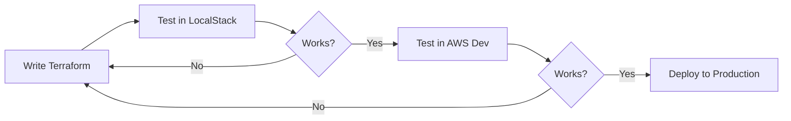

# 🤔 Why Use LocalStack?

## TL;DR

**Test your Terraform and AWS infrastructure code locally without spending money or waiting for slow deployments.**

## 💰 The Problem

Testing infrastructure on real AWS:
- **Costs money** - Even "testing" creates billable resources
- **Slow** - RDS takes 5-10 minutes to provision
- **Risky** - Easy to forget resources running ($$$)
- **Cleanup hassle** - Have to destroy everything after testing

```bash
# Testing on real AWS
terraform apply   # ⏰ Wait 10 minutes...
# Oops, typo in config!
terraform destroy # ⏰ Wait 10 minutes...
terraform apply   # ⏰ Wait 10 minutes...
# Found another issue!
terraform destroy # ⏰ Wait 10 minutes...

# Total: 40 minutes + AWS charges 💸
```

## ✅ The LocalStack Solution

```bash
# Testing with LocalStack
terraform apply   # ⚡ 10 seconds
# Oops, typo!
terraform destroy # ⚡ 5 seconds
terraform apply   # ⚡ 10 seconds
# Fixed!

# Total: 25 seconds + $0 💚
```

## 🎯 What LocalStack is Good For

### ✅ Perfect Use Cases

1. **Testing Terraform configurations**
   - Validate syntax and logic
   - Test module interfaces
   - Verify resource relationships
   - Iterate quickly on infrastructure code

2. **CI/CD pipelines**
   ```yaml
   # GitHub Actions
   - name: Test Terraform
     run: |
       docker run -d -p 4566:4566 localstack/localstack
       terraform init
       terraform apply -auto-approve
   ```

3. **Learning AWS services**
   - Experiment without fear
   - No surprise bills
   - Unlimited testing

4. **Development workflow**
   - Test infrastructure changes before production
   - Validate AWS API integration
   - Catch errors early

### ❌ What LocalStack Cannot Do

1. **Real database connections** - Cannot run SQL queries against LocalStack RDS
2. **Performance testing** - Not representative of real AWS
3. **Complete feature parity** - Some advanced AWS features missing
4. **Production replacement** - Never use for actual workloads

## 📊 Comparison

| Aspect | LocalStack | Real AWS |
|--------|-----------|----------|
| **Cost** | Free | $$ Pay per resource |
| **Speed** | Seconds | Minutes |
| **Risk** | Zero | High (forgot destroy?) |
| **Learning** | Safe sandbox | Expensive mistakes |
| **Terraform Testing** | ✅ Perfect | 💸 Overkill |
| **Database Testing** | ❌ API only | ✅ Full features |
| **Production** | ❌ Never | ✅ Always |

## 🎓 Recommended Workflow



1. **LocalStack** - Quick iteration, syntax validation
2. **AWS Dev** - Real testing, integration validation  
3. **AWS Prod** - Final deployment

## 💡 Real-World Example

### Without LocalStack
```bash
# You: "Let me test if this RDS config works..."
$ terraform apply
# ⏰ 10 minutes later...
# AWS: "Error: Invalid subnet configuration"
$ terraform destroy
# ⏰ 10 minutes later...
$ vim rds.tf  # Fix config
$ terraform apply
# ⏰ 10 minutes later...
# AWS: "Error: Security group rule conflict"
$ terraform destroy
# ⏰ 10 minutes later...
# AWS: "That'll be $5.47 for your testing" 💸

# Total time: 40 minutes
# Total cost: $5.47
# Sanity: 📉
```

### With LocalStack
```bash
# You: "Let me test if this RDS config works..."
$ terraform apply
# ⚡ 10 seconds later...
# LocalStack: "Error: Invalid subnet configuration"
$ vim rds.tf  # Fix config
$ terraform apply
# ⚡ 10 seconds later...
# LocalStack: "Error: Security group rule conflict"
$ vim rds.tf  # Fix config
$ terraform apply
# ⚡ 10 seconds later...
# LocalStack: "Success!" ✅

# Now deploy to real AWS with confidence
$ terraform apply -var-file=prod.tfvars
# ✅ Works first try!

# Total time: 30 seconds + 10 minutes
# Total cost: $0 (testing) + real deployment cost
# Sanity: 📈
```

## 🎯 The Bottom Line

> [!TIP]
> **Use LocalStack to test your Terraform code, not your application.**

LocalStack is your **safety net** for infrastructure development:
- ✅ Catch Terraform errors instantly
- ✅ Iterate fast without costs
- ✅ Learn AWS without fear
- ✅ Validate infrastructure before deployment

It won't replace real AWS testing, but it will save you **time, money, and headaches** during development.

---

**Think of it like:** LocalStack is to AWS what a flight simulator is to flying a real plane. You learn the controls, practice procedures, and catch mistakes safely before the real thing.
